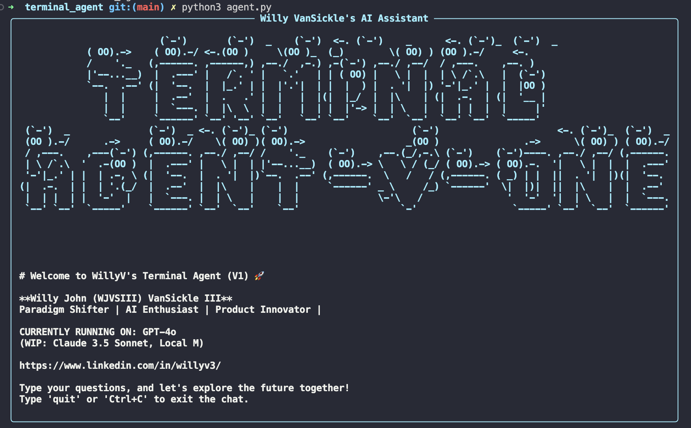

# WillyV's AI Assistant Terminal Chat



Welcome to WillyV's AI Assistant Terminal Chat! This powerful and highly customizable tool combines the capabilities of GPT-4o and SearxNG to provide an intelligent, web-aware chatbot right in your terminal. Designed to be flexible and extensible, it can be tailored to suit a wide range of use cases and personal preferences.

## Table of Contents

- [Features](#features)
- [Demo](#demo)
- [Prerequisites](#prerequisites)
- [Installation](#installation)
- [Usage](#usage)
- [Customization](#customization)
- [Configuration](#configuration)
- [Troubleshooting](#troubleshooting)
- [Contributing](#contributing)
- [License](#license)

## Features

- 🧠 Powered by OpenAI's GPT-4o for intelligent conversations
- 🌐 Web search capabilities using SearxNG
- 💾 Conversation memory for context-aware responses
- 🎨 Rich, colorful terminal interface using Rich library
- 🔄 Dynamic search refinement based on conversation context
- 🛠️ Highly customizable with support for additional tools and persona modifications
- 🔌 Extensible architecture allowing integration of various LangChain tools


## Prerequisites

Before you begin, ensure you have the following installed:

- Python 3.8+
- Docker (for running SearxNG)
- OpenAI API key

## Installation

1. Clone this repository:
   ```
   git clone https://github.com/yourusername/willyvs-ai-assistant.git
   cd willyvs-ai-assistant/terminal_agent
   ```

2. Install the required Python packages:
   ```
   pip install -r requirements.txt
   ```

3. Set up SearxNG using Docker:
   ```
   docker pull searxng/searxng
   docker run -d -p 8080:8080 -e BASE_URL=http://localhost:8080/ searxng/searxng
   ```

4. Create a `.env` file in the `terminal_agent` directory and add your OpenAI API key:
   ```
   OPENAI_API_KEY=your_api_key_here
   ```

## Usage

To start the AI Assistant Terminal Chat, run:

```
python agent.py
```

Once launched, you can start chatting with the AI assistant. Type your questions or statements, and the assistant will respond based on its knowledge and web search results.

To exit the chat, simply type 'quit'.

## Customization

One of the key strengths of this AI Assistant is its flexibility and customizability. Here are some ways you can tailor it to your specific needs:

### Adding New Tools

You can easily extend the assistant's capabilities by integrating additional tools from LangChain's extensive library. 


### Modifying Agent Persona

You can give your AI assistant a unique personality or tailor its behavior for specific use cases by modifying the system prompts. In `agent.py`, locate the `ChatPromptTemplate` definitions and adjust the system messages to reflect the desired persona or behavior.

Example for a more formal, business-oriented assistant:
```python
system_message = """You are a professional business consultant AI assistant. 
Your responses should be formal, concise, and focused on providing 
actionable business advice. Always consider the business context and 
potential financial implications in your answers."""
```

### Customizing Search Behavior

You can modify the search behavior by adjusting the `searx_wrapper` configuration in `agent.py`. This includes changing the search engines used, the number of results returned, or even implementing your own search method.

## Configuration

You can customize the behavior of the AI assistant by modifying the following parameters in `agent.py`:

- `searx_host`: Change this if you're running SearxNG on a different host or port
- `engines`: Modify the list of search engines used by SearxNG
- `llm`: Adjust the OpenAI model or parameters as needed

## Troubleshooting

- **SearxNG connection issues**: Ensure Docker is running and the SearxNG container is active. Check if you can access `http://localhost:8080` in your browser.
- **OpenAI API errors**: Verify that your API key is correct and you have sufficient credits.
- **Slow responses**: This can be due to network latency or high usage of the OpenAI API. Try adjusting the `max_tokens` parameter in the `ChatOpenAI` configuration.
- **Integration issues with new tools**: Make sure you've properly initialized the tool and added it to the `tools` list. Check the LangChain documentation for specific tool requirements.

## Contributing

Contributions are welcome! Whether it's adding new features, improving documentation, or reporting bugs, your input is valuable. Please feel free to submit a Pull Request or open an Issue.

## License

This project is licensed under the MIT License - see the [LICENSE](LICENSE) file for details.

---

Created with ❤️ by William Van Sickle

Empower your terminal with AI - customize, extend, and make it your own!