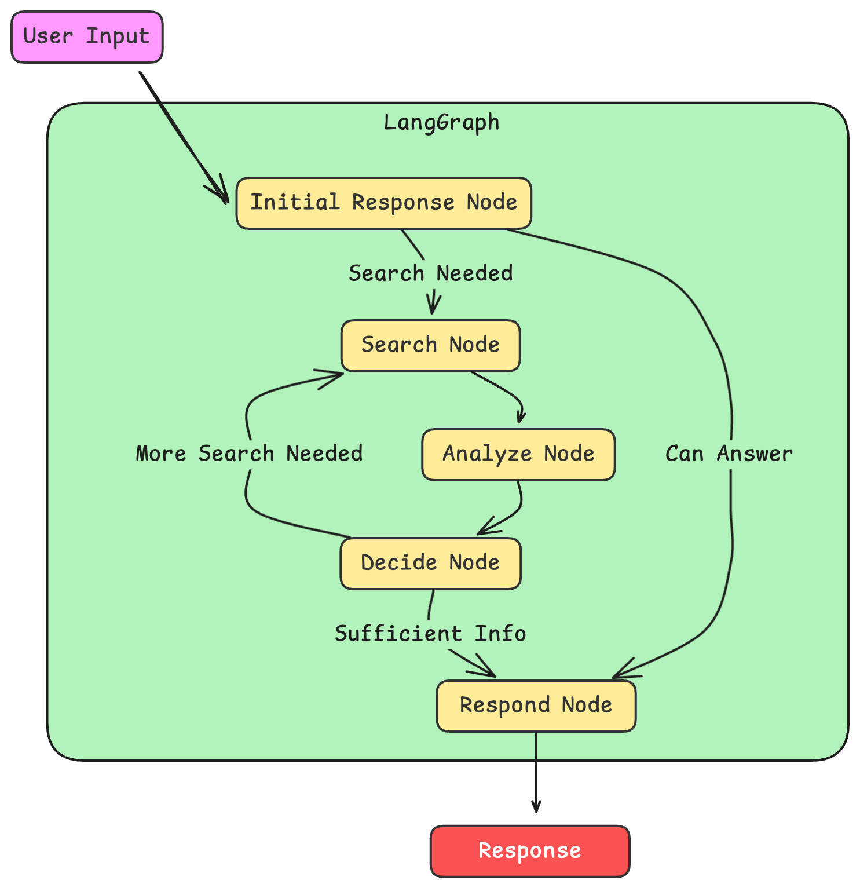

# AI-Powered Terminal Agent with Web Search Capabilities

## Overview

This project brings an intelligent AI assistant to your terminal, capable of answering questions, performing web searches, and maintaining context across conversations. It's designed for developers, researchers, and anyone who wants quick access to information without leaving the command line.

## Features

- **Intelligent Conversations**: Ask questions on any topic and get informed responses.
- **Web Search Integration**: Perform web searches directly from your terminal using SearxNG.
- **Context Retention**: Engage in multi-turn conversations with memory of previous interactions.
- **Flexible AI Models**: Choose between OpenAI and Anthropic models.
- **Rich Terminal Interface**: Enjoy syntax highlighting, markdown rendering, and formatted responses.
- **Interactive Setup**: Easy-to-use configuration process with a welcoming ASCII art interface.
- **Customizable Configuration**: Easily modify settings through the `config.json` file.

## Prerequisites

- Python 3.7+
- pip (Python package manager)

## Installation

1. Clone the repository:
   ```
   git clone https://github.com/yourusername/ai-terminal-agent.git
   cd ai-terminal-agent
   ```

2. Install dependencies:
   ```
   pip install -r requirements.txt
   ```

## Configuration

1. Run the agent for the first time:
   ```
   python agent.py
   ```

2. Follow the interactive setup process:
   - Choose your preferred AI provider (OpenAI or Anthropic)
   - Enter your API key
   - Select the AI model

3. Your configuration will be saved in `config.json`

To reconfigure:
- Delete `config.json` and run `agent.py` again, or
- Choose to reconfigure when prompted during startup

## Usage

1. Start the agent:
   ```
   python agent.py
   ```

2. Begin chatting with your AI assistant in the terminal.

3. To perform a web search, use a command like:
   ```
   search: What's the latest news about AI?
   ```

4. To exit the application, type `exit`, `quit`, or use Ctrl+C.

## Customization

- Modify `config.json` to change AI provider, model, or other settings.
- Edit `ascii_art.py` to customize the welcome message.
- Adjust `config_manager.py` to add new configuration options.

## Project Structure

- `agent.py`: Main entry point for the application
- `llm_components/`: Contains core logic for AI interactions
  - `graph_nodes.py`: Defines the conversation flow
  - `nodes.py`: Implements individual conversation nodes
  - `shared.py`: Shared utilities and functions
- `config_manager.py`: Handles configuration loading and saving
- `ascii_art.py`: Generates the welcome ASCII art
- `.env`: (Create this file) Store sensitive information like API keys

## Contributing

Contributions are welcome! Please feel free to submit a Pull Request.

## License

This project is open source and available under the [MIT License](LICENSE).

## Acknowledgements

- OpenAI and Anthropic for their powerful language models
- SearxNG for providing web search capabilities

For any issues or feature requests, please open an issue on the GitHub repository.

Happy chatting with your AI terminal agent!

## SearxNG Setup

This project uses SearxNG for web search capabilities. To set up your own SearxNG instance:

1. Clone the SearxNG Docker repository:
   ```
   git clone https://github.com/searxng/searxng-docker.git
   cd searxng-docker
   ```

2. Edit the `.env` file to set your hostname and email:
   ```
   sed -i "s|SEARXNG_HOSTNAME=<your hostname>|SEARXNG_HOSTNAME=localhost|g" .env
   ```

3. Generate a secret key:
   ```
   sed -i "s|ultrasecretkey|$(openssl rand -hex 32)|g" searxng/settings.yml
   ```

4. Start SearxNG:
   ```
   docker compose up -d
   ```

5. Ensure the JSON format is enabled. Edit `searxng/settings.yml`:
   ```yaml
   search:
       formats:
           - html
           - json
   ```

6. Restart SearxNG to apply changes:
   ```
   docker compose restart
   ```

7. Test the API:
   ```
   curl -kLX GET --data-urlencode q='test' -d format=json http://localhost:8888
   ```

8. Update the `config.json` in your AI Terminal Agent project with the SearxNG host:
   ```json
   {
     "searxng_host": "http://localhost:8888"
   }
   ```

For more detailed information, refer to the [SearxNG Docker GitHub repository](https://github.com/searxng/searxng-docker) and [LangChain's SearxNG integration documentation](https://python.langchain.com/docs/integrations/providers/searx/).

## LangGraph Flow

The following diagram illustrates the LangGraph flow in our AI Terminal Agent, focusing on the nodes defined in `graph_nodes.py`:



This visual representation helps to understand how different nodes interact within the LangGraph framework:

- **Initial Response Node**: Attempts to answer the query without searching.
- **Search Node**: Performs web searches using SearxNG when needed.
- **Analyze Node**: Processes and summarizes search results.
- **Decide Node**: Determines whether to search again or proceed to respond.
- **Respond Node**: Generates the final response to the user.

The flow shows the decision-making process, including when to search for information and when to respond directly, creating a dynamic and adaptive conversation flow.
